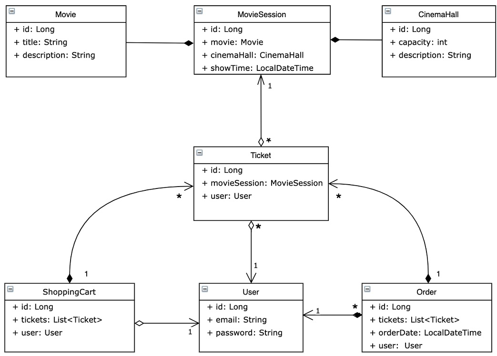

# CINEMA APPLICATION
**Description** 📄

This project is a simple web application of the cinema that supports such functions:
- new user registration and login for registered users
- add and remove movie, movie session and cinema hall
- add the tickets to the shopping cart and complete the order

**Features** 📡

|  Role   | Endpoint                                                                                                                                                                                                                                                                    |
|:-------:|:----------------------------------------------------------------------------------------------------------------------------------------------------------------------------------------------------------------------------------------------------------------------------|
| `ADMIN` | POST: `/register`   GET: `/cinema-halls` POST:`/cinema-halls` GET: `/movies` POST: `/movies` GET: `/movie-sessions/available` POST: `/movie-sessions` PUT: `/movie-sessions/{id}` DELETE: `/movie-sessions/{id}` GET: `/users/by-email` |
| `USER`  | POST: `/register`   GET: `/cinema-halls` GET: `/movies` GET: `/movie-sessions/available` GET: `/orders` POST: `/orders/complete` PUT: `/shopping-carts/movie-sessions` GET: `/shopping-carts/by-user`                                           |

**Project structure** 📄

The project based on N-Tier architecture:
- DAO layer - CRUD operations with database entities
- DTO layer - representing models on UI layer
- Service layer - business logic of the application
- Controllers - accept requests from the clients and send responses

**Technologies** 📡
- JDK
- Hibernate ORM
- Spring Framework
- Tomcat
- MySQL
- Maven

**Instruction to run the project** 📄
1. Fork this repository
2. Clone your repository to IDE
3. Configure - [/resources/db.properties](https://github.com/vov4ik89/cinema-app/blob/main/src/main/resources/db.properties)
4. Install Tomcat
5. Configure Tomcat Server
6. Run the project (You can log in using username = admin@i.ua and password = admin)

